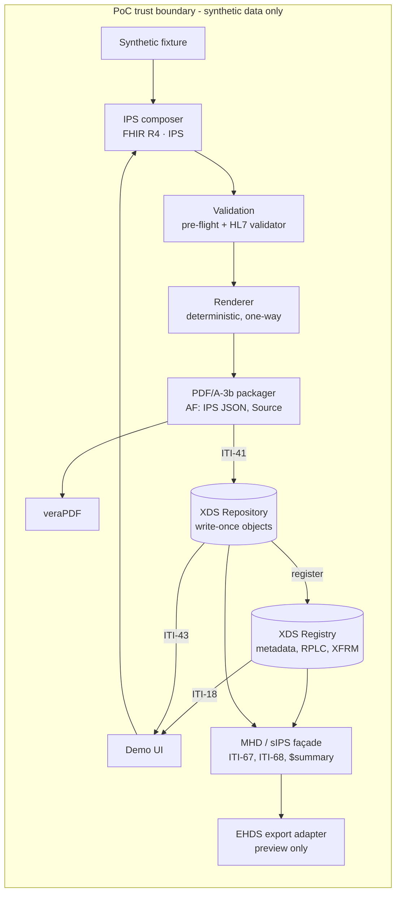

# EHDS Structured Clinical Document PoC

**Preserve the clinical document. Exchange the computable summary.**

This project demonstrates a preservation-oriented clinical document pattern. It creates a FHIR International Patient Summary, renders it for human use, embeds the exact structured document inside a PDF/A-3 preservation envelope, and demonstrates XDS/MHD discovery and retrieval. It includes an EHDS-oriented export preview but is not an EHDS or MyHealth@EU implementation and must not be used with real patient data.

> **Synthetic data only.** This is a demonstrator. It is not a certified or conformance-tested EHDS, MyHealth@EU, NCPeH, IHE XDS.b, MHD, sIPS or HL7 IPS implementation, and its security controls are deliberately demonstration-grade. Every HTTP response carries `X-SCDPOC-Demo-Only: true`.

[Quick start](#quick-start) · [The journey](#the-journey) · [Architecture](#architecture) · [Standards baseline](#standards-baseline) · [Evidence](#evidence-and-acceptance-tests) · [Adopting it](#adopting-and-extending) · [Limitations](#limitations)

---

## The claim

A healthcare organisation can retain a durable, human-intelligible clinical document *and* its computable IPS representation together, while serving each representation through standards-appropriate interfaces, **without making the preservation container itself the cross-border protocol**.

Two artefacts, one clinical statement:

| | Preserved envelope | Exchange projection |
|---|---|---|
| Form | PDF/A-3b, IPS embedded as an Associated File (`AFRelationship=Source`) | FHIR R4 IPS document Bundle (`application/fhir+json`) |
| Purpose | Preservation, audit, legacy human consumption | Standards-native computable retrieval |
| XDS formatCode | `urn:scdpoc:format:pdfa3b-ips-envelope:v1` (locally governed) | `urn:ihe:pcc:ips:2020` |
| Relationship | Authoritative package for the issuance event | Byte-identical to the embedded file; registered as an **XFRM** of the envelope |

## Quick start

### Docker (recommended)

```bash
docker compose up --build
# open http://localhost:8080
```

### Python 3.12+

```bash
python -m venv .venv && . .venv/bin/activate
pip install -r requirements.lock -e ".[dev]"
scdpoc serve --port 8080          # UI at http://localhost:8080, OpenAPI at /docs
pytest                            # unit, integration and acceptance tests
scripts/demo.sh http://localhost:8080   # scripted walkthrough with curl
```

No secrets, accounts or external services are needed. State is written to `./var` (or `$SCDPOC_DATA_DIR`).

### Optional: full validation

| Variable | Effect |
|---|---|
| `SCDPOC_HL7_VALIDATOR_JAR=/path/validator_cli.jar` | Runs the official HL7 FHIR validator against `hl7.fhir.uv.ips#2.0.1` at compose time (needs Java 17+) |
| `SCDPOC_VERAPDF_CLI=/path/verapdf` or `SCDPOC_VERAPDF_URL=http://verapdf:8080` | Validates every envelope with veraPDF (PDF/A-3B profile) |
| `SCDPOC_REQUIRE_HL7_VALIDATOR=true` / `SCDPOC_REQUIRE_VERAPDF=true` | Closes the publication gate unless the external validator ran and passed |

Without them the UI says plainly that the HL7 validator and veraPDF were **not run** and that conformance is not claimed.

## The journey

The UI walks one synthetic patient through ten steps, showing the artefact, validation result and provenance at each step rather than a success message.

1. **Choose a synthetic patient** - three fixtures (`fixtures/synthetic-patients/`), guarded by the synthetic-data rules.
2. **Compose the IPS** - FHIR Bundle, Composition first, required sections, profiles, terminology systems.
3. **Validate** - offline pre-flight plus the HL7 FHIR validator when configured. Structural errors block publication.
4. **Render** - deterministic HTML generated from the same IPS instance.
5. **Package** - PDF/A-3b envelope; Associated Files inventory; SHA-256 of the envelope and the embedded IPS; byte-identity and rendition checks.
6. **Validate the preservation format** - veraPDF result and downloadable machine-readable report; built-in pre-flight shown separately and labelled as a subset.
7. **Publish** - two genuine ITI-41 SOAP/MTOM submissions; DocumentEntries, SubmissionSets and associations; raw request/response.
8. **Discover and retrieve** - ITI-18 (SOAP) and ITI-67 (FHIR) side by side, with an equivalence check; ITI-43 retrieve and seven integrity checks.
9. **Exchange projection** - the IPS via ITI-68 as `application/fhir+json`, not scraped from the PDF.
10. **EHDS preview** - a configuration-driven register showing what is demonstrated, optional, unresolved or out of scope.

Plus: **replacement** (v2 RPLC-replaces v1; v1 stays retrievable), **tamper simulations** (altered embedded IPS; appended bytes), and an **on-demand current summary** (`Patient/$summary`) that is explicitly distinct from issued snapshots.

## Architecture



Key decisions are recorded as ADRs in [`adr/`](adr/):

| ADR | Decision |
|---|---|
| [001](adr/001-fhir-ips-is-structured-source.md) | The IPS Bundle is the authoritative structured source; rendering is one-way |
| [002](adr/002-pdfa3-preservation-envelope.md) | PDF/A-3b envelope with the IPS as an Associated File (`Source`) |
| [003](adr/003-xds-mhd-separation.md) | Two DocumentEntries per issuance (envelope, IPS projection via XFRM); MHD as a façade |
| [004](adr/004-ehds-adapter-boundary.md) | EHDS specifics behind an export adapter, driven by a register in configuration |
| [005](adr/005-python-implementation-stack.md) | Python stack - a recorded deviation from the Java reference design |
| [006](adr/006-sqlite-metadata-store.md) | SQLite metadata and write-once filesystem repository |

More detail: [`docs/architecture.md`](docs/architecture.md).

## Standards baseline

| Concern | Baseline | Status | How it is used |
|---|---|---|---|
| Patient Summary dataset | ISO 27269:2025 | International Standard | Semantic anchor; not reproduced here |
| Computable summary | HL7 FHIR IPS 2.0.1 (FHIR R4) | STU / trial use | Pinned in `config/ips-package.yml` |
| Document sharing | IHE XDS.b (ITI TF Rev 20.2) | Final Text | ITI-41, ITI-18, ITI-43 |
| FHIR document access | IHE MHD 4.2.4 | Trial Implementation | ITI-67, ITI-68 façade |
| IPS sharing | IHE sIPS 1.0.0 | Trial Implementation | Direct IPS projection; on-demand `$summary` |
| Preservation | PDF/A-3b (ISO 19005-3) | Published | Envelope with Associated File |
| European exchange | EHDS Regulation (EU) 2025/327, EEHRxF, MyHealth@EU | In force; implementing acts continue | Non-normative preview and adapter boundary only |

See [`docs/standards-baseline.md`](docs/standards-baseline.md) for what is and is not implemented from each.

## Evidence and acceptance tests

The demonstrator is meant to prove invariants, not just render screens. Each acceptance test from the reference design is automated:

| ID | Invariant | Where it runs |
|---|---|---|
| AT-01 | IPS validates against the pinned package with zero errors | Pre-flight: every `pytest` run. HL7 validator: CI `validators` job |
| AT-02 | Bundle is `document`, has identifier and timestamp, Composition first | `pytest` |
| AT-03 | Same IPS + renderer version → byte-identical pages and envelope; IPS digests match recorded values | `pytest` |
| AT-04 | Extracted Associated File bytes equal the validated IPS bytes | `pytest` |
| AT-05 | Envelope is PDF/A-3b | Pre-flight: `pytest`. veraPDF: CI `validators` job |
| AT-06 | ITI-41 succeeds, ITI-18 finds, ITI-43 returns byte-identical PDF | `pytest` (real SOAP endpoints) |
| AT-07 | MHD search corresponds to the XDS entries | `pytest` |
| AT-08 | IPS obtained as `application/fhir+json` without unpacking the PDF | `pytest` |
| AT-09 | New version current; old snapshot deprecated but retrievable and intact | `pytest` |
| AT-10 | Altered embedded IPS or appended bytes fail integrity checks | `pytest` |
| AT-11 | EHDS preview separates demonstrated facts from unresolved requirements | `pytest` |
| AT-12 | Clean clone, no secrets, starts with `docker compose up` | `pytest` (repository scan) + CI `docker` job |

**Release status (v0.1.0).** All tests that do not need an external validator pass. The HL7 FHIR validator and veraPDF steps (AT-01 full, AT-05 full) are wired into CI but had **not yet been executed** when this release was prepared; the first CI run on GitHub is the first time they run. Treat their results, and any fixes they prompt, as part of verifying this release. CI uploads an evidence bundle (fixture artefacts, validator outcomes, SBOM) for every run.

## Repository layout

```
├── adr/                    architecture decision records
├── config/                 affinity-domain policy, pinned standards, EHDS readiness register, IPS profile digest
├── docs/                   architecture, standards baseline, extending guide, API notes
├── fixtures/               synthetic patients and expected deterministic digests
├── scripts/                demo walkthrough, external validator runners, CI helpers
├── src/scdpoc/
│   ├── ips/                composer, view model, validation
│   ├── render/             deterministic HTML and PDF renditions
│   ├── pdfa/               PDF/A-3b packaging, extraction, pre-flight, veraPDF
│   ├── xds/                XDS.b Registry/Repository, ebRIM, SOAP/MTOM, client
│   ├── mhd/                MHD / sIPS FHIR façade
│   ├── ehds/               EHDS export adapter boundary and preview
│   ├── demo/               tutorial orchestration (non-normative REST)
│   ├── integrity.py        integrity checks and tamper simulations
│   ├── safety.py           synthetic-data guard
│   └── static/             UI (vanilla HTML/CSS/JS, no build chain)
└── tests/                  unit, integration, acceptance (AT-01..AT-12)
```

## Interfaces

| Interface | Contract |
|---|---|
| `POST /xds/repository` | ITI-41 Provide and Register Document Set-b; ITI-43 Retrieve Document Set (SOAP 1.2, WS-Addressing, MTOM/XOP) |
| `POST /xds/registry` | ITI-18 Registry Stored Query: FindDocuments, GetDocuments, GetRelatedDocuments |
| `GET /fhir/DocumentReference` | ITI-67 (`patient.identifier`, `status`, `format`) |
| `GET /fhir/Binary/{id}` | ITI-68 |
| `GET /fhir/Patient/$summary?identifier=` | On-demand current IPS (tagged `on-demand`, never registered) |
| `/api/demo/*` | Tutorial orchestration - convenient, **not** an interoperability specification |

## Adopting and extending

The code is organised so that an EHDS-facing service can keep the parts that carry the pattern and replace the demonstrator parts:

- **Keep**: the one-way IPS → view → rendition rule, the PDF/A-3 packaging and extraction, the integrity checks, the two-representation registration with distinct format codes, and the adapter boundary.
- **Replace**: the fixture loader (with your clinical data extract), the XDS actors (with production XDS infrastructure), the SQLite store, and the preview adapter (with an implementation of the adopted EEHRxF specification).

[`docs/extending.md`](docs/extending.md) lists the extension points with the exact interfaces, and the production gaps you must close.

## Limitations

This PoC does not resolve national patient identity, clinician identity, consent, purpose-of-use, terminology licensing, national code-system selection, digital signatures, clinical safety case, retention schedules, records-management law, cross-border trust, NCPeH onboarding, production availability, performance or disaster recovery. Each would materially affect a production architecture. The most important standards uncertainty is the detailed EEHRxF/MyHealth@EU implementation profile under EHDS; the adapter boundary exists so that the preservation, sharing and authoring logic do not need re-engineering when that detail changes.

## Licence

Apache License 2.0 - see [`LICENSE`](LICENSE) and [`NOTICE.md`](NOTICE.md). ISO standards are referenced, not reproduced. No licensed terminology content is distributed; see [`config/terminology/README.md`](config/terminology/README.md).
