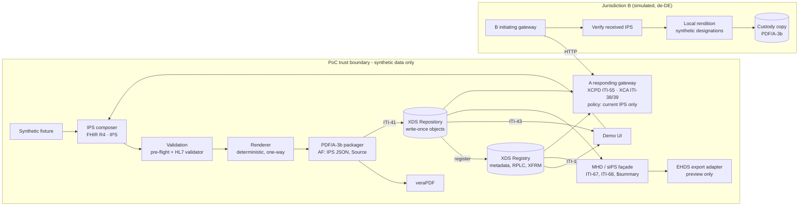

# EHDS Structured Clinical Document PoC

**Preserve the clinical document. Exchange the computable summary.**

This project demonstrates a preservation-oriented clinical document pattern. It creates a FHIR International Patient Summary, renders it for human use, embeds the exact structured document inside a PDF/A-3 preservation envelope, and demonstrates XDS/MHD discovery and retrieval. It includes an EHDS-oriented export preview but is not an EHDS or MyHealth@EU implementation and must not be used with real patient data.

> **Synthetic data only.** This is a demonstrator. It is not a certified or conformance-tested EHDS, MyHealth@EU, NCPeH, IHE XDS.b, MHD, sIPS or HL7 IPS implementation, and its security controls are deliberately demonstration-grade. Every HTTP response carries `X-SCDPOC-Demo-Only: true`.

[Quick start](#quick-start) · [The journey](#the-journey) · [Conformance kit](#conformance-kit-v04) · [Cross-border (v0.2)](#cross-border-v02) · [Architecture](#architecture) · [Standards baseline](#standards-baseline) · [Evidence](#evidence-and-acceptance-tests) · [Adopting it](#adopting-and-extending) · [Limitations](#limitations)

---

## The claim

A healthcare organisation can retain a durable, human-intelligible clinical document *and* its computable IPS representation together, while serving each representation through standards-appropriate interfaces, **without making the preservation container itself the cross-border protocol**.

Two artefacts, one clinical statement:

| | Preserved envelope | Exchange projection |
|---|---|---|
| Form | PDF/A-3b, IPS embedded as an Associated File (`AFRelationship=Source`) | FHIR R4 IPS document Bundle (`application/fhir+json`) |
| Purpose | Preservation, audit, legacy human consumption | Standards-native computable retrieval |
| XDS formatCode | `urn:scdpoc:format:pdfa3b-ips-envelope:v1` (locally governed) | `http://hl7.org/fhir/uv/ips/StructureDefinition/Bundle-uv-ips` (sIPS, system `urn:ietf:rfc:3986`) |
| Relationship | Authoritative package for the issuance event; registered as an **XFRM** of the IPS (it is rendered from it) | The structured source; byte-identical to the embedded file; replacements chain by **RPLC** |

Every issuance also says honestly how it was assured: a **machine-generated preserved snapshot** (the default: the
author is the generating software, and no attestation is claimed anywhere) or an **attested clinical issuance** (an
explicit attestation action, recorded with who, when, how and the digest of what was reviewed).

## Quick start

### Docker (recommended)

```bash
docker compose up --build
# open http://localhost:8080
```

### Python 3.12+

```bash
python -m venv .venv && . .venv/bin/activate
pip install -r requirements.lock -e ".[dev]"
scdpoc serve --port 8080          # UI at http://localhost:8080, OpenAPI at /docs
pytest                            # unit, integration and acceptance tests
scripts/demo.sh http://localhost:8080   # scripted walkthrough with curl
```

No secrets, accounts or external services are needed. State is written to `./var` (or `$SCDPOC_DATA_DIR`).

### Optional: full validation

| Variable | Effect |
|---|---|
| `SCDPOC_HL7_VALIDATOR_JAR=/path/validator_cli.jar` | Runs the official HL7 FHIR validator against `hl7.fhir.uv.ips#2.0.1` at compose time (needs Java 17+) |
| `SCDPOC_VERAPDF_CLI=/path/verapdf` or `SCDPOC_VERAPDF_URL=http://verapdf:8080` | Validates every envelope with veraPDF (PDF/A-3B profile) |
| `SCDPOC_REQUIRE_HL7_VALIDATOR=true` / `SCDPOC_REQUIRE_VERAPDF=true` | Closes the publication gate unless the external validator ran and passed |

Without them the UI says plainly that the HL7 validator and veraPDF were **not run** and that conformance is not claimed.

## The journey

The UI walks one synthetic patient through ten steps, showing the artefact, validation result and provenance at each step rather than a success message.

1. **Choose a synthetic patient** - three fixtures (`fixtures/synthetic-patients/`), guarded by the synthetic-data rules.
2. **Compose the IPS** - FHIR Bundle, Composition first, required sections, profiles, terminology systems. The draft is a preserved snapshot; **Attest this draft** demonstrates the attestation action (option AI) and produces a new, attested draft with its evidence.
3. **Validate** - offline pre-flight plus the HL7 FHIR validator when configured. Structural errors block publication.
4. **Render** - deterministic HTML generated from the same IPS instance.
5. **Package** - PDF/A-3b envelope; Associated Files inventory; SHA-256 of the envelope and the embedded IPS; byte identity, and the rendition fidelity contract checked independently of the renderer.
6. **Validate the preservation format** - veraPDF result and downloadable machine-readable report; built-in pre-flight shown separately and labelled as a subset.
7. **Publish** - one genuine ITI-41 SOAP/MTOM submission carrying both DocumentEntries and their associations, accepted or rejected as a unit; raw request/response.
8. **Discover and retrieve** - ITI-18 (SOAP) and ITI-67 (FHIR) side by side, with an equivalence check; ITI-43 retrieve and seven integrity checks.
9. **Exchange projection** - the IPS via ITI-68 as `application/fhir+json`, not scraped from the PDF.
10. **EHDS preview** - a configuration-driven register showing what is demonstrated, optional, unresolved or out of scope.

Plus the **lifecycle**: replacement for update and for correction (a new issuance with RPLC; a correction has status `amended` and records a notification-required event), and **withdrawal** without replacement (one ITI-57 Update Document Set deprecates both entries; the gateway then releases nothing). Every transition follows the profile's state table and is a **preservation event** in a hash-chained log; **Run fixity check** compares every stored artefact with the SHA-256 recorded at issuance. Also: **tamper simulations** and an **on-demand current summary** (`Patient/$summary`) that is explicitly distinct from issued snapshots.

## Conformance kit (v0.5)

The *IPS Preservation Envelope Profile* 0.4.0 (published as a separate repository) defines 109 numbered rules
containing 128 **normative obligations**. Each obligation has one requirement level (MUST, MUST NOT, SHOULD or SHOULD
NOT) and its own id: `ENV-11` for a rule with one obligation, `REN-04.a` and `REN-04.b` for a rule with several. The
profile's build publishes them as a machine-readable **rule catalogue**, vendored here as
[`conformance/rules.json`](conformance/rules.json), with the version-locked
[`conformance/dependencies.json`](conformance/dependencies.json). The Checker is driven by the catalogue: for a claim
(conformance classes, options and **actor bindings**) it reports **every applicable obligation** with its level, an
outcome per verification method and the evidence, and a **verdict**:

| Verdict | When |
|---|---|
| `non-conformant` | an applicable MUST / MUST NOT obligation failed |
| `incomplete` | otherwise, an applicable mandatory obligation is `not-tested` (for example veraPDF or the HL7 validator not run) |
| `conformant` | every applicable mandatory obligation passed or is not applicable |

Failed SHOULD / SHOULD NOT obligations are reported as **warnings** and never decide the verdict. Results, claims
and manifests that refer to an unknown obligation, test or outcome are rejected, not ignored (CHK-10).

```bash
scdpoc check-vectors --out vectors.json            # Checker over every vector, plus Checker self-tests (L-15)
scdpoc live-check --out live.json                  # live scenarios L-01..L-16 on a fresh in-process instance
scdpoc check conformance/vectors/V-01/envelope.pdf \
  --projection conformance/vectors/V-01/projection.json \
  --record conformance/vectors/V-01/issuance-record.json \
  --claim conformance/claims/demonstrator.json --evidence live.json --evidence vectors.json
scdpoc fixity --data-dir var                       # independent fixity check of issued artefacts
```

Verification methods: `artefact` (offline, from envelope, projection and issuance record), `live` (scenarios against
a running system), `claim` (from the conformance claim), `vectors` (Checker over the vectors) and `inspection`
(declared in the claim, reported as declared). Options: **AI** Attested Issuance, **PP** Protected Preservation,
**MHD** façade, **OD** On-Demand; obligations of an unclaimed option are `not-applicable`. A claim declares, per class,
the **actor bindings** it implements, and is required to support only their transactions: a Receiver that uses MHD
alone declares `MHD Document Consumer` and is not required to implement XCA. Each dependency in a claim has a
**status** - `exact`, `permitted-alternative` or `unsupported-deviation`; a deviation is never eligible for a
conformant verdict.

Every vector expectation carries its justification in [`conformance/vectors/manifest.json`](conformance/vectors/manifest.json):

| Vector | Change | Must fail |
|---|---|---|
| V-01 | none: valid preserved snapshot | nothing |
| V-02 | none: valid attested issuance produced by the attestation sequence (option AI) | nothing |
| I-01 | embedded IPS dosage altered, pages unchanged | ENV-05, REN-02, XCH-02 |
| I-02 | `AFRelationship` set to `/Data` | ENV-02, ENV-06.a |
| I-04 | one medication omitted from the pages | REN-02 |
| I-05 | second `Source` attachment | ENV-06.a |
| I-06 | non-embedded standard font | ENV-01 (not ENV-10: a standard font has a Unicode mapping) |
| I-07 | genuine incremental update after issuance | ENV-11 |
| I-08 | `Bundle.type` = `collection` | SRC-01 |
| I-09 | projection re-serialised | XCH-02, SRC-02 |
| I-10 | narrative-only section omitted from the pages | REN-02, REN-12 |
| I-11 | dose on the pages differs from the source | REN-10 |
| I-12 | record claims attestation without evidence | PROV-04 (and PROV-02.a with option AI) |
| I-13 | legal attester in the source without evidence (the 0.2.0 behaviour) | PROV-04, IPS-03 |
| I-14 | a problem code shown in the medication section | REN-08 |
| I-15 | `Composition.status` = `preliminary` | IPS-04 |
| I-16 | nested section; the nested entry's dosage timing omitted | REN-02, REN-12 |
| I-17 | ToUnicode maps removed from the embedded fonts | ENV-10 (advisory: a warning) |
| I-18 | attested issuance whose dose changed after attestation (option AI) | PROV-02.b, IPS-07 |
| I-19 | boundary: a Condition stage (coverage disposition N) populated | nothing; REN-14 `not-tested` |

I-03 and the registry, lifecycle, gateway and preservation obligations are exercised by the live scenarios (L-01
publish, L-02 registry failure, L-03 invalid metadata, L-04 update, L-05 correction, L-06 withdrawal, L-07 stale
summary, L-08 MHD identity and times, L-09 cross-border, L-10 fixity, L-11 assurance, person and organisational
attestation, L-12 issuance gate, L-14 content changed after attestation, L-16 lifecycle meaning across layers). L-15,
the Checker's self-tests, runs with the vectors.

**What the kit says about this demonstrator.** Evaluated against its own claim
([`conformance/claims/demonstrator.json`](conformance/claims/demonstrator.json)), the verdict is
**non-conformant**, for documented reasons: in this environment the HL7 FHIR validator and veraPDF do not gate
issuance (SRC-04, ENV-08), terminology versions are not recorded (PRES-01), and the authorisation, cross-border
security and clinical risk declarations that a real deployment must make are not made (SEC-01.a, SEC-02, SEC-03).
The Checker comes from the same project, so its reports are evidence, not independent assurance (CHK-05). The
fidelity checks are text-based and cannot establish clinical semantic equivalence or clinical safety.

## Cross-border (v0.2)

A second synthetic jurisdiction reads the summary. **Jurisdiction A** issues and preserves; **Jurisdiction B** (de-DE, its own patient index) is where a visiting patient is seen. B reaches A only through A's responding gateway, over HTTP:

| Step | What happens | Evidence shown |
|---|---|---|
| B1 Discover | ITI-55 (XCPD): B sends demographics; A discloses its patient id only on an unambiguous exact match | HL7 V3 request/response; link B-id ↔ A-id; `NF` for a B-only resident |
| B2 Query and retrieve | ITI-38 / ITI-39 (XCA): B asks for *everything*; A's gateway policy releases only the **current IPS** | Documents returned; six verification checks (hash, size, format, pre-flight, subject, status); simulated NCP pivot check |
| B3 Render | B renders the received IPS in German from synthetic designations | Translation coverage; untranslated codes flagged in the rendition; free-text dosage passed through and reported |
| B4 Preserve | B keeps a write-once custody copy: PDF/A-3b with the received IPS embedded and the German pages | Byte identity, all codes visible, PDF/A pre-flight |

The PDF/A envelope never crosses the border - A's gateway refuses it - so the claim that *the preservation container is not the cross-border protocol* is enforced, not just stated. What B receives is byte-identical to the Associated File inside A's preserved envelope. See [ADR-007](adr/007-simulated-cross-border-exchange.md).

> This is a simulation between synthetic jurisdictions. It is not MyHealth@EU, uses no real catalogue or transcoding service, and establishes no cross-border trust. Whether MyHealth@EU uses these IHE transactions or FHIR-based equivalents should be checked against current specifications before extending this layer.

## Architecture



Key decisions are recorded as ADRs in [`adr/`](adr/):

| ADR | Decision |
|---|---|
| [001](adr/001-fhir-ips-is-structured-source.md) | The IPS Bundle is the authoritative structured source; rendering is one-way |
| [002](adr/002-pdfa3-preservation-envelope.md) | PDF/A-3b envelope with the IPS as an Associated File (`Source`) |
| [003](adr/003-xds-mhd-separation.md) | Two DocumentEntries per issuance; MHD as a façade (binding details superseded by ADR-008) |
| [004](adr/004-ehds-adapter-boundary.md) | EHDS specifics behind an export adapter, driven by a register in configuration |
| [005](adr/005-python-implementation-stack.md) | Python stack - a recorded deviation from the Java reference design |
| [006](adr/006-sqlite-metadata-store.md) | SQLite metadata and write-once filesystem repository |
| [007](adr/007-simulated-cross-border-exchange.md) | Simulated cross-border exchange; gateway releases only the current IPS |
| [008](adr/008-corrected-ihe-binding-and-fidelity.md) | sIPS format code, XFRM envelope → IPS, one atomic submission, RPLC on the IPS, independent fidelity check |
| [009](adr/009-assurance-lifecycle-and-conformance-kit.md) | Profile 0.3.0: assurance levels, canonical fidelity forms, server-assigned MHD ids, lifecycle state model with ITI-57, hash-chained preservation events, catalogue-driven Checker with verdicts |
| [010](adr/010-obligations-bindings-and-lifecycle-meaning.md) | Profile 0.4.0: normative obligations with levels, actor bindings, coverage matrix, withdrawal distinguished from replacement in every layer, time and author mappings, attestation sequence with a content digest |

More detail: [`docs/architecture.md`](docs/architecture.md).

## Standards baseline

| Concern | Baseline | Status | How it is used |
|---|---|---|---|
| Patient Summary dataset | ISO 27269:2025 | International Standard | Semantic anchor; not reproduced here |
| Computable summary | HL7 FHIR IPS 2.0.1 (FHIR R4) | STU / trial use | Pinned in `config/ips-package.yml` and `conformance/dependencies.json` |
| Document sharing | IHE XDS.b (ITI TF Rev 20.2) | Final Text | ITI-41, ITI-18, ITI-43 |
| Metadata update | IHE XDS Metadata Update supplement Rev 1.14 | Trial Implementation | ITI-57 Update Document Set (UpdateAvailabilityStatus) for withdrawal |
| FHIR document access | IHE MHD 4.2.4 | Trial Implementation | ITI-67, ITI-68 façade; server-assigned ids; typed identifier slices |
| IPS sharing | IHE sIPS 1.0.0 | Trial Implementation | Direct IPS projection; on-demand `$summary` |
| Preservation | PDF/A-3b (ISO 19005-3) | Published | Envelope with Associated File |
| Cross-community exchange | IHE XCPD (ITI-55), XCA (ITI-38, ITI-39) | Final Text | Demonstrator subsets between two synthetic jurisdictions (v0.2) |
| European exchange | EHDS Regulation (EU) 2025/327, EEHRxF, MyHealth@EU | In force; implementing acts continue | Non-normative preview, simulated NCP pivot check, adapter boundary |

See [`docs/standards-baseline.md`](docs/standards-baseline.md) for what is and is not implemented from each.

## Evidence and acceptance tests

The demonstrator is meant to prove invariants, not just render screens. Each acceptance test from the reference design is automated:

| ID | Invariant | Where it runs |
|---|---|---|
| AT-01 | IPS validates against the pinned package with zero errors | Pre-flight: every `pytest` run. HL7 validator: CI `validators` job |
| AT-02 | Bundle is `document`, has identifier and timestamp, Composition first | `pytest` |
| AT-03 | Same IPS + renderer version → byte-identical pages and envelope; IPS digests match recorded values | `pytest` |
| AT-04 | Extracted Associated File bytes equal the validated IPS bytes | `pytest` |
| AT-05 | Envelope is PDF/A-3b | Pre-flight: `pytest`. veraPDF: CI `validators` job |
| AT-06 | ITI-41 succeeds, ITI-18 finds, ITI-43 returns byte-identical PDF | `pytest` (real SOAP endpoints) |
| AT-07 | MHD search corresponds to the XDS entries | `pytest` |
| AT-08 | IPS obtained as `application/fhir+json` without unpacking the PDF | `pytest` |
| AT-09 | New version current; old snapshot deprecated but retrievable and intact | `pytest` |
| AT-10 | Altered embedded IPS or appended bytes fail integrity checks | `pytest` |
| AT-11 | EHDS preview separates demonstrated facts from unresolved requirements | `pytest` |
| AT-12 | Clean clone, no secrets, starts with `docker compose up` | `pytest` (repository scan) + CI `docker` job |
| XB-AT-01..09 | Cross-border: exact-match discovery, no disclosure on no-match, gateway releases only current IPS, envelope refused, received bytes identical to A's Associated File, superseded versions stay home, honest translation, write-once custody copy, simulated status in register | `pytest` (real gateway SOAP endpoints); custody PDF/A by veraPDF in CI |

Profile 0.3.0 adds automated acceptance tests for each review item: mutation tests (dose, frequency, route, allergy severity, uncertainty, temporal qualifiers) and an omission test for every contract element (`tests/acceptance/test_fidelity_030.py`); assurance, MHD identity, the issue-replace-correct-withdraw sequence, atomic ITI-57, stale summaries, receiver provenance and fixity (`test_profile_030.py`); and the catalogue-driven Checker, its verdicts with validators disabled and enabled, vectors and live scenarios (`test_checker_030.py`).

Profile 0.4.0 (review 3) adds: per-obligation evaluation of a rule with a mandatory and an advisory obligation, actor bindings with an MHD-only receiver, dependency statuses, and rejection of undefined references (`test_checker_030.py`); altered-value and swapped-association mutation tests for every entry type, the coverage-matrix N disposition, attested-content-digest invariance, MHD time and author mapping, and the receiver's display of a withdrawn summary (`test_review3_profile_040.py`); and live scenarios L-14 and L-16.

**Release status (v0.5.0).** All tests that do not need an external validator pass. The HL7 FHIR validator (pinned 7.0.1) and veraPDF (pinned 1.30.3) steps are wired into CI and install exactly those versions, but had **not yet been executed** for this release; independent IPS and PDF/A validation reports are therefore not yet available. CI uploads an evidence bundle - Checker reports per vector, live-scenario results, validator outputs, SBOM and an evidence manifest binding them to the commit - for every run.

## Repository layout

```
├── adr/                    architecture decision records
├── conformance/            rules.json (rule catalogue), dependencies.json (version lock), claims/, vectors/
├── config/                 affinity-domain policy, pinned standards, EHDS register, IPS profile digest, crossborder/
├── docs/                   architecture, standards baseline, extending guide, API notes
├── fixtures/               synthetic patients and expected deterministic digests
├── scripts/                demo walkthrough, external validator runners, CI helpers
├── src/scdpoc/
│   ├── crossborder/        v0.2: XCPD/XCA gateway (A), initiating gateway, localisation and custody (B)
│   ├── ips/                composer, view model, validation
│   ├── render/             deterministic HTML and PDF renditions
│   ├── pdfa/               PDF/A-3b packaging, extraction, pre-flight, veraPDF
│   ├── xds/                XDS.b Registry/Repository, ebRIM, SOAP/MTOM, client
│   ├── mhd/                MHD / sIPS FHIR façade
│   ├── ehds/               EHDS export adapter boundary and preview
│   ├── demo/               tutorial orchestration (non-normative REST)
│   ├── fidelity.py         rendition fidelity contract, derived independently of the renderer
│   ├── checker.py          catalogue-driven Checker: per-rule outcomes per method, verdict
│   ├── conformance_kit.py  vector runs and live scenarios L-01..L-12
│   ├── vectors.py          deterministic conformance test vectors
│   ├── lifecycle.py        issuance lifecycle state-transition table
│   ├── preservation.py     hash-chained preservation events and independent fixity check
│   ├── integrity.py        integrity checks and tamper simulations
│   ├── safety.py           synthetic-data guard
│   └── static/             UI (vanilla HTML/CSS/JS, no build chain)
└── tests/                  unit, integration, acceptance (AT-01..AT-12)
```

## Interfaces

| Interface | Contract |
|---|---|
| `POST /xds/repository` | ITI-41 Provide and Register Document Set-b; ITI-43 Retrieve Document Set (SOAP 1.2, WS-Addressing, MTOM/XOP) |
| `POST /xds/registry` | ITI-18 Registry Stored Query: FindDocuments, GetDocuments, GetRelatedDocuments; ITI-57 Update Document Set (UpdateAvailabilityStatus) |
| `GET /fhir/DocumentReference` | ITI-67 (`patient.identifier`, `status`, `format`, `identifier`, `_id`); ids are server-assigned |
| `GET /fhir/Binary/{id}` | ITI-68 (follow `content.attachment.url`; never construct the id) |
| `GET /fhir/Patient/$summary?identifier=` | On-demand current IPS (tagged `on-demand`, never registered) |
| `POST /gateway/xcpd` | Jurisdiction A responding gateway: ITI-55 Cross Gateway Patient Discovery (subset) |
| `POST /gateway/xca` | Jurisdiction A responding gateway: ITI-38 Cross Gateway Query, ITI-39 Cross Gateway Retrieve (subset) |
| `/api/demo/xb/*` | Jurisdiction B orchestration - non-normative |
| `/api/demo/*` | Tutorial orchestration - convenient, **not** an interoperability specification. Includes `attest/{draft}`, `withdraw/{patient}`, `preservation/events`, `preservation/fixity` |

## Adopting and extending

The code is organised so that an EHDS-facing service can keep the parts that carry the pattern and replace the demonstrator parts:

- **Keep**: the one-way IPS → view → rendition rule, the PDF/A-3 packaging and extraction, the integrity checks, the two-representation registration with distinct format codes, and the adapter boundary.
- **Replace**: the fixture loader (with your clinical data extract), the XDS actors (with production XDS infrastructure), the SQLite store, and the preview adapter (with an implementation of the adopted EEHRxF specification).

[`docs/extending.md`](docs/extending.md) lists the extension points with the exact interfaces, and the production gaps you must close.

## Limitations

This PoC does not resolve national patient identity, clinician identity, consent, purpose-of-use, terminology licensing, national code-system selection, digital signatures, clinical safety case, retention schedules, records-management law, cross-border trust, NCPeH onboarding, production availability, performance or disaster recovery. Each would materially affect a production architecture. The most important standards uncertainty is the detailed EEHRxF/MyHealth@EU implementation profile under EHDS; the adapter boundary exists so that the preservation, sharing and authoring logic do not need re-engineering when that detail changes.

## Licence

Apache License 2.0 - see [`LICENSE`](LICENSE) and [`NOTICE.md`](NOTICE.md). ISO standards are referenced, not reproduced. No licensed terminology content is distributed; see [`config/terminology/README.md`](config/terminology/README.md).
