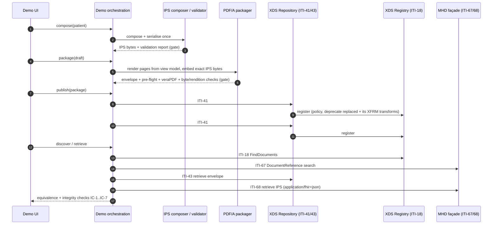

# Architecture

## Components and responsibilities

| Module | Responsibility | Replaceable by an adopter? |
|---|---|---|
| `safety.py` | Synthetic-data guard; fixed fixture path | Remove only when moving to a governed environment |
| `ips/composer.py` | Map a source record to an IPS document Bundle; serialise **once** | Yes - replace the source mapping with your clinical extract |
| `ips/view.py` | Single view model derived from coded IPS content | Keep (one-way rendering rule) |
| `ips/validator.py` | Offline pre-flight + HL7 FHIR validator wrapper; publication gate | Keep gate; swap engines as needed |
| `render/` | Deterministic HTML and PDF pages from the view model | Yes, if the one-way rule and IC-7 check are kept |
| `pdfa/` | PDF/A-3b packaging, Associated File extraction, pre-flight, veraPDF | Keep pattern; packager internals replaceable |
| `integrity.py` | Issuance-record checks (IC-1..IC-7), tamper simulations | Keep |
| `xds/` | XDS.b Repository and Registry actors, ebRIM, SOAP/MTOM, Document Source/Consumer client | Yes - production XDS infrastructure |
| `mhd/` | ITI-67/68 façade and `Patient/$summary` | Yes - production MHD Document Responder |
| `ehds/` | Export adapter boundary and readiness preview | Yes - this is the intended extension point |
| `demo/` | Tutorial orchestration, file-backed work records | Demonstrator only |

## Issuance sequence



## Integrity checks

Each retrieval (and each tamper simulation) is checked against the record made at issuance:

| ID | Check | Detects |
|---|---|---|
| IC-1 | Envelope SHA-256 equals issuance record | Any change to the stored package |
| IC-2 | XDS `hash` (SHA-1) and `size` match | Repository/registry inconsistency |
| IC-3 | An Associated File with `AFRelationship=Source`, `application/fhir+json` exists | Stripped or relabelled payload |
| IC-4 | Embedded IPS SHA-256 equals issuance record | Altered structured payload |
| IC-5 | Embedded IPS byte-identical to the exchange projection | Divergence between preserved and exchanged representations |
| IC-6 | Embedded Bundle identifier equals the registered document | Payload swapped from another issuance |
| IC-7 | Every fact derived from the embedded IPS appears in page text | Pages and payload saying different things |

## Lifecycle

| Object | Lifecycle | Registry behaviour |
|---|---|---|
| Issued PDF/A envelope | Immutable stable document | New version = new DocumentEntry with RPLC; old entry Deprecated, still retrievable |
| Issued IPS projection | Immutable, byte-identical to the envelope's Associated File | Registered with XFRM to its envelope; deprecated with it |
| Current IPS (`Patient/$summary`) | On-demand | Never registered; tagged `on-demand` |

## Data on disk

```
$SCDPOC_DATA_DIR/
├── scdpoc.sqlite3        registry metadata, repository index, audit log
├── repository/           write-once objects (mode 0444, O_EXCL)
└── work/
    ├── drafts/<id>/      ips.json + record.json (validation evidence)
    ├── packages/<id>/    envelope.pdf, verapdf-report.xml, record.json, publication.json
    └── patients/<key>/   issuances.json, state.json
```
